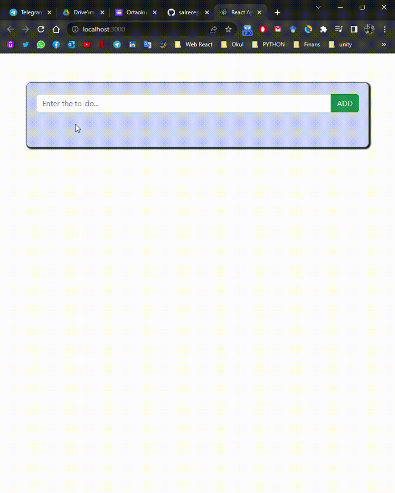

### TO-DO APP

A project I developed using React. Difference from my previous todoapp project, here I saved data with axios library using json-server. In this way, I have a better understanding of how the backand process works.

